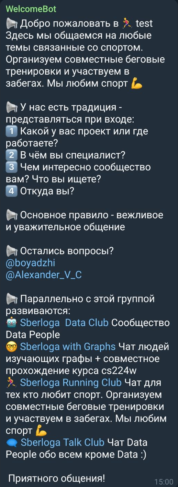

# SberlogaWelcome_Bot

#### A Python Telegram Bot that greets everyone who joins a group chat and deletes welcome message after a while

## Bot commands

Welcomes everyone that enters a group chat that this bot is a part of. By default, only the person who invited the bot into the group is able to change settings.
Commands:  
  
`/welcome` - Set welcome message  
`/goodbye` - Set goodbye message  
`/get_welcome` - Returns current welcome message  
`/get_goodbye` - Returns current goodbye message    
`/disable_goodbye` - Disable the goodbye message  
`/lock` - Only the person who invited the bot can change messages  
`/unlock` - Everyone can change messages  
`/quiet` - Disable "Sorry, only the person who..." & help messages  
`/unquiet` - Enable "Sorry, only the person who..." & help messages  

You can use _$username_ and _$title_ as placeholders when setting messages. [HTML formatting](https://core.telegram.org/bots/api#formatting-options) is also supported.


## How to use

1. Invite `@SberlogaWelcome_Bot` to your chat
2. Give `admin` privilages to bot (bot deletes welcome messages after some period of time)
3. Set up welcome message  
For example:
```python
/welcome :loudspeaker: Добро пожаловать в 🥇 $title
Здесь организовано неформальное общение датасаентистов.

:loudspeaker: У нас есть традиция - представляться при входе:
1⃣ Какой у вас проект или где работаете?
2⃣ В чём вы специалист?
3⃣ Чем интересно сообщество вам? Что вы ищете?
4⃣ Откуда вы?

:loudspeaker: Основное правило - вежливое и уважительное общение

:loudspeaker: Остались вопросы?
@boyadzhi
@Alexander_V_C

:loudspeaker: Параллельно с этой группой развиваются:
🤖 <a href="https://t.me/joinchat/AqeZ2hg_WQzwCwNMRIyA1w">Sberloga  Data Club</a> Сообщество Data People 
🤓 <a href="https://t.me/joinchat/AqeZ2hptcOis2DB34FaZxg">Sberloga with Graphs</a> Чат людей изучающих графы + совместное прохождение курса cs224w
:runner:♂ <a href="https://t.me/joinchat/AqeZ2hh0VBmEumKYJmN6MQ">Sberloga Running Club</a> Чат для тех кто любит спорт. Организуем совместные беговые тренировки и участвуем в забегах. Мы любим спорт :muscle:
🗨 <a href="https://t.me/joinchat/AqeZ2kvXBm5bMY3ULG8MoA">Sberloga Talk Club</a> Чат Data People обо всем кроме Data :) 
```


## Make your own bot
1. Clone repo
2. Add new app in heroku.com
3. Add Heroku Postgres addon
4. Add Config Vars to you app:
 - BOTNAME
 - TOKEN
 - DATABASE_URL (added automatically)
5. DDD - Davai Davai Deploy. Just deploy this sh*t already. Come on!```